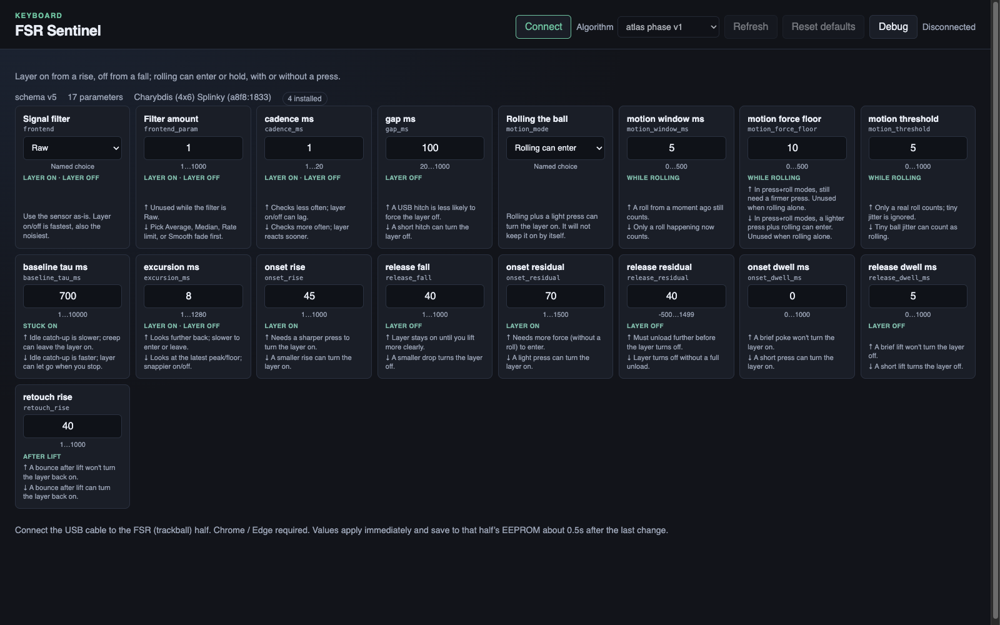

# FSR layer

A QMK Community Module that turns an analog force-sensitive resistor into a
stable touch signal for QMK Auto Mouse. It includes four selectable detectors,
trackball-motion-aware modes, console diagnostics, a Raw HID configuration
protocol, and EEPROM-backed runtime settings.



Capture and console field documentation lives in [`LOGGING.md`](LOGGING.md).

## How it works

1. The sensor half samples the configured analog pin. Dan's Charybdis uses
   GP26 for three force sensors wired in parallel under the trackball.
2. The selected detector converts the ADC stream into one boolean touch state.
   Motion-aware algorithms also consume accumulated trackball deltas without
   changing the pointer report.
3. `is_fsr_touched()` exposes that state. With `FSR_MOUSE_LAYER` and QMK Auto
   Mouse enabled, QMK activates the configured mouse layer while touch remains
   active and applies its normal timeout after release.
4. `FSR_CAL` resets detector state and forces release. `FSR_TOG` disables or
   re-enables sampling and reinitializes the runtime.

The module does not call `layer_on()` or `layer_off()` directly. Link it from
`keymap.json`, define `FSR_ENABLE`, and let QMK Auto Mouse own layer timing.

## Algorithms

All four implementations remain compiled into one runtime registry. The active
algorithm can be changed without rebuilding firmware.

| ID | Algorithm | Behavior |
|---:|---|---|
| 1 | `v1_dual_cusum` | Frozen Run7 Sentinel. Median-of-three input, a rate-limited idle center, cumulative touch and release evidence, and a post-release recovery blank. Ignores trackball motion. |
| 2 | `v2_signal_envelope` | Signal-only adaptive envelope. Tracks an idle floor, freezes a touch anchor, and releases near the anchor or after a drop from a decaying peak. Ignores trackball motion. |
| 3 | `v3_motion_envelope` | V2 envelope plus bounded motion-assisted onset and release confirmation. Uses a private motion accumulator and does not modify pointer movement. |
| 4 | `atlas_phase_v1` | Experimental bidirectional phase latch with selectable filtering, cadence, motion modes, dwell, baseline tracking, and rebound quarantine. Exposes 17 editable parameters. |

Without valid saved state, `atlas_phase_v1` is the current boot default. V1 is
the frozen rollback/reference implementation.

## Web configurator and EEPROM

The WebHID configurator lives in the qmk_userspace repository:

- [`tools/fsr-sentinel-web`](https://github.com/dan-dr/qmk_userspace/tree/main/tools/fsr-sentinel-web)

Serve that userspace locally, open the tool in Chrome or Edge, and connect the
USB cable to the FSR/trackball half. Firmware reports the current schema,
installed algorithms, active algorithm, parameter metadata, and values. The UI
therefore follows the firmware instead of carrying a separate hardcoded list.

Selecting an algorithm or editing a value applies immediately. The firmware
increments a generation counter, resets the detector, and forces release before
the next sample so old state is never interpreted with new parameters.

Every change marks the FSR configuration dirty. About 0.5 seconds after the last
edit, firmware writes one CRC-protected blob to that half's EEPROM containing:

- the runtime schema version
- the active algorithm
- every algorithm's parameter block, not only the visible one

On boot, the sensor half restores that blob, including the last selected
algorithm. A schema mismatch, invalid algorithm ID, or bad CRC rejects the blob
and restores compile-time defaults. EEPROM is local to the physical half, so
connect and configure the half that owns the FSR. A successful connection or
EEPROM save proves transport and persistence only; it does not prove the chosen
detector is safe from false activation or a stuck mouse layer.

## Runtime details

V2 and v3 use a causal median-of-three front end. V2 tracks an idle Q8 floor,
confirms an upward excursion, freezes the touch anchor, and releases on a
confirmed return near that anchor or a drop from a decaying Q8 peak. V3 uses
the same envelope with bounded motion-assisted onset and release confirmation.
V3 consumes its own 20 ms motion accumulator and does not affect pointer data.

Atlas Phase v1 is the implementation candidate from the Atlas v3 clean-slate
protocol. It defaults to raw input and exposes all 17 front-end, cadence, gap,
motion, and phase parameters through the registry. Its state machine freezes
the unloaded baseline while touched, releases on a bidirectional fall, tracks a
post-release floor, quarantines rebound for 60 ms, and permits early relatch
only when both force and recent motion support it. The shipped defaults are the
2026-08-12 EEPROM snapshot (notably `motion_window_ms` 5, `motion_force_floor`
10, `motion_threshold` 5, `baseline_tau_ms` 1500, `onset_rise` 45,
`release_fall` 40, `onset_residual` 70, `release_residual` 40,
`release_dwell_ms` 5, `retouch_rise` 40). It is the boot default.

The technical evidence identifiers and replay metrics are in the ignored local
`fsr-recordings/2026-08-06-scan-161857/analysis/sentinel-successors/REPORT.md`.
Neither successor reached zero error. They are installed for deliberate live
comparison, not silently enabled.

Host state sizes are 40 bytes for v1, 44 bytes for a successor, 376 bytes for
Atlas Phase, and 384 bytes for the runtime union. A static assertion enforces a
384-byte runtime budget. Atlas keeps 130 causal history values to match the
frozen reference. Host parity checks cover all five front ends, motion, dwell,
gap reset, and `uint32_t` clock wrap.

## FSR Sentinel v1 integration

FSR Sentinel v1 is the human-facing name for the frozen
`run7-provisional-v1` experiment and evidence identifier. It is a causal dual
CUSUM detector with a causal median-of-three front end, a rate-limited Q8 idle
center, positive touch evidence, negative release-step evidence, and a recovery
blank.

Frozen parameters:

| Parameter | Value |
|---|---:|
| `center_rate` | 30 ADC counts per 20 ms |
| `recovery_blank_ms` | 60 ms |
| `release_drift` | 0 ADC counts |
| `release_score` | 70 |
| `score_leak` | 5 per 20 ms |
| `touch_drift` | 15 ADC counts |
| `touch_score` | 100 |

The detector uses `uint16_t` ADC values and saturated scores, an `int32_t` Q8
center, and `uint32_t` time and scan counters. A static assertion enforces the
validated conservative 56-byte state budget. Work is constant per invocation,
with no allocation.

The selected Sentinel is always the source of `is_fsr_touched()` and QMK Auto
Mouse activation. V1 through v3 run at `FSR_SENTINEL_SHADOW_INTERVAL_MS`
(default 20 ms; the ddyo keymap may override). Atlas runs at its editable
1-to-20 ms cadence. The ddyo keymap currently enables compact CSV output on
every 1 ms scan. When compact mode is disabled, console debug buffers samples
and flushes them as separate `FSR SCAN` lines every `FSR_DEBUG_INTERVAL_MS` -
see [`LOGGING.md`](LOGGING.md). A pause of at least `FSR_SENTINEL_SHADOW_GAP_MS`,
default 40 ms, creates a synthetic scan gap and clears accumulated evidence.

Each fixed-cadence `FSR` row carries the selected Sentinel `touch`, `state`,
`alg`, and `gen`. `m:x,y` is trackball motion since the previous row. V1 and v2
ignore motion; v3 and Atlas consume detector-cadence motion. Boot and re-enable
seed from the first Sentinel sample. `FSR_CAL` and the 60-second timeout reset
the runtime and force an active release. `FSR_TOG` stops FSR sampling and
reinitializes the runtime.

The frozen parameters are compile-time defaults and the boot values until EEPROM
restores a prior live edit. Override compile-time defaults in keymap `config.h`
with the `FSR_SENTINEL_*` names from `fsr_sentinel.h`, or change them live over
Raw HID (prefix `0x91`) with
[`tools/fsr-sentinel-web`](https://github.com/dan-dr/qmk_userspace/tree/main/tools/fsr-sentinel-web).
Live edits persist
on the FSR/trackball half only. Any override is a local variant and must not be
reported as validated `run7-provisional-v1` behavior.

When adding a v1 parameter, extend its frozen registry and preserve reference
parity. Successor algorithms and parameter schemas live in
`fsr_sentinel_runtime.c`. Bump `FSR_SENTINEL_RUNTIME_SCHEMA_VERSION` for a
protocol-visible schema change. The web app discovers both lists from firmware.

### GP26 sensor topology and divider

GP26 is fed by three legacy RP-C5ST-0.1G sensors under the trackball, connected
in parallel to one ADC channel. GP28 can host an optional FSR400 thumb witness
(`FSR_WITNESS_ENABLE` in the ddyo keymap); it is disabled by default. Do not
use FSR400 electrical curves to calibrate GP26.

For the three parallel main sensors:

```text
1 / Req = 1 / R1 + 1 / R2 + 1 / R3
```

The RP-C5ST Rev A datasheet says individual sensor conductance, `1/R`, is
approximately linear with force. Conductances therefore add approximately with
the load supported by each trackball leg. In the ideal identical linear case,
redistributing a constant total load is invisible on GP26. Multiple knees imply
a total-load change, sensor mismatch, nonlinearity, hysteresis, or mechanical
coupling. The shared channel cannot identify which leg caused them.

Dan believes the main GP26 hardware currently uses a 470-ohm fixed resistor.
The RP-C5ST datasheet shows about 5 kilohms in its suggested divider circuit.
That does not prove 5 kilohms is better for this preloaded parallel assembly.
Preserve the raw readings and verify the resistor and board orientation before
treating either value as calibration metadata.

For the documented divider:

```text
3.3 V -> FSR -> ADC node -> fixed resistor -> GND
Vadc = 3.3 V * Rfixed / (Rfsr + Rfixed)
```

Changing the fixed resistor changes ADC level and touch delta by a
force-dependent amount. There is no universal scale factor because `Req`
depends on all three local loads.

Do not scale detector parameters from a guessed resistor ratio. Diagnose from
the combined GP26 trace before editing:

- missed touches with low `sentinel_pos`: lower touch drift and touch score
- touch works but release sticks with low `sentinel_neg`: lower release score
- idle activations: raise touch drift or touch score
- slow idle drift accumulating evidence: raise center rate cautiously
- post-release rebound activation: inspect the trace before extending the blank

The GP28 thumb witness (when `FSR_WITNESS_ENABLE` is set) is a contact label,
not a calibration measurement for the main GP26 divider. Keep both raw readings
when comparing. With the witness disabled, GP28 is unused by FSR.

## Evidence and limitations

When the intentionally ignored Run7 evidence tree is present, the portable live
core is host-checked against pinned hashes of the frozen reference and all 4,426
canonical Run7 rows, including internal state and transition reasons. The
standalone state-machine tests remain portable without that evidence tree. This
is replay proof, not physical validation.

Run7 does not support a zero-perceptible-error claim:

- development: 52 of 55 reviewed onsets matched, 54 of 55 usable
- locked holdout: 8 of 10 evaluable onsets matched, 10 of 10 usable
- holdout false activation was not measurable because it had no certain
  no-contact support
- 338 firmware scans were absent from the logged evidence
- full live scan-rate behavior, other sensors, mounting conditions, sessions,
  and users remain unvalidated

Sentinel and witness logging add console traffic. Physical validation must check scan gaps,
USB console effects, boot behavior, detector decisions, and unchanged pointing
behavior on a new untouched synchronized capture. Do not infer hardware success
from host replay or a firmware build.

## Test gate and rollback

The current keymap enables Sentinel for deliberate hardware testing. A passing
test still uses the frozen gate from `COMPARISON_REPORT.md`: every evaluable
touch usable within 100 ms, zero raw activation during confirmed no-contact,
zero Auto Mouse contact gaps, no gap-inclusive perceived tail over 300 ms after
uncertainty, and no tail over three seconds.

Runtime rollback is selecting ID 1 in the WebHID tool or rebooting. There is no
compile-time dual-detector fallback; the old edge detector was removed.
